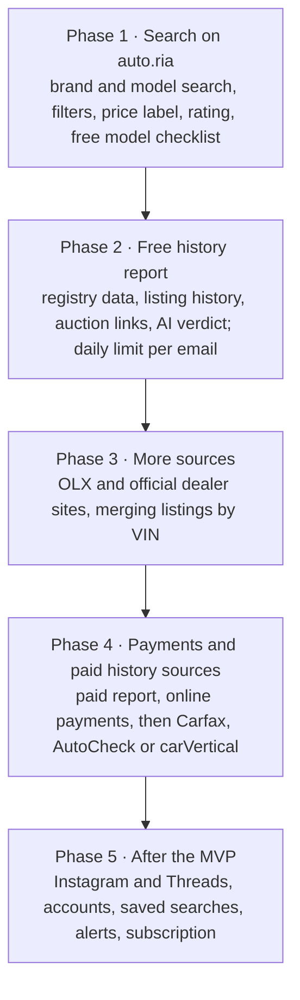

# Avtoskop — MVP Product Definition

Sep 27, 2026 · @Kostiantyn

## Product summary

Avtoskop (Автоскоп, avtoskop.com.ua) is a website that helps a private buyer in Ukraine find a car and judge if a specific listing is worth buying. It gathers listings from many sites in one place, labels each price as cheap, fair or overpriced, and gives a per-car history report (free with a daily limit in the MVP).

- **Who it is for:** private buyers looking for one car for themselves. Not dealers.
- **Market:** Ukraine. Cars that are already in Ukraine and ready to drive, including imported and repaired ones.
- **Vehicle type:** passenger cars and SUVs only.
- **The problem:** buyers check 4 or more sites by hand, cannot tell a fair price, and do not know the car's past.

**Core flow**

1. Choose vehicle type (cars only in the MVP).
2. Choose brand.
3. Choose model.
4. See one list of new and used offers from all sources, with filters and a price label on each.
5. Open one car: all its sources, price history, and the free model checklist.
6. Optionally request the AI report for that car by email.

## Free features

Everything a buyer needs to find and compare cars is free. It brings visitors and shows the value of the history report.

| Feature         | What the user sees                                                                                                                                                      |
| --------------- | ----------------------------------------------------------------------------------------------------------------------------------------------------------------------- |
| Combined search | One list of offers from all connected sources for the chosen model                                                                                                      |
| Car rating      | A 0–100 score on every offer, combining price, mileage, history, listing behaviour and listing quality, with the top three reasons. Results are sorted by it by default |
| New cars        | Dealer cars mixed into the same list with a "New" label, so new and used can be compared by price                                                                       |
| Filters         | Year, price, mileage, fuel, gearbox, region; imported or sold new in Ukraine; accident history; customs status                                                          |
| Price label     | Cheap / fair / overpriced for each listing, compared with similar cars (same model, year, mileage range)                                                                |
| Merged card     | One card per car when the same VIN (the car's unique 17-character ID) appears on several sites                                                                          |
| Model checklist | Known weak spots for the model, generation and engine. Made once by AI, stored, shown free                                                                              |

The model checklist costs almost nothing to show: it is generated once per model and generation (about 500 pairs), not per user.

## History report

In the MVP the report is free: the user enters an email and gets \[N\] reports per day per email. It is delivered by private link and email. It uses free data sources only, so each report costs us only the AI call. The report becomes paid after the MVP, when online payments are added.

**What the report contains**

- Summary verdict for this specific car: buy, check carefully, or avoid, with reasons.
- Ukrainian registry facts: registration operations, region changes, stolen-car check.
- Import history for foreign cars: auction records found by VIN (sale date, damage type, mileage at sale), with links to the auction photos.
- Our own listing history: earlier listings of this VIN, price changes, mileage changes, old photos.
- Car-specific advice: what to inspect on this car, based on the model checklist plus its damage and mileage history.
- Recalls and factory data for the VIN.

**Free data sources for the MVP**

| Source                                                        | What it gives                                             | Cost               | Limits                                                                         |
| ------------------------------------------------------------- | --------------------------------------------------------- | ------------------ | ------------------------------------------------------------------------------ |
| Ukrainian MVS open data (data.gov.ua)                         | Registration operations, wanted (stolen) cars list        | Free               | Bulk files updated on a schedule, not live; fields to be checked               |
| NHTSA VIN decoder and recalls                                 | Factory specs and open recalls for US-market cars         | Free, official API | US-market cars only                                                            |
| Auction archive sites (bidfax, bid.cars, autoastat, stat.vin) | Copart / IAAI sale records and photos by VIN              | Free to view       | No official API, they block automated access, photos are owned by the auctions |
| Our own listing archive                                       | Earlier listings, prices, mileage, photos of the same VIN | Free               | Grows over time; thin at launch                                                |

For auction sites, the safe MVP approach is to link to the VIN page on those sites rather than copy their data or photos. Paid sources (Carfax, AutoCheck, carVertical) come after the MVP, together with payments.

Open question: the daily limit per email, and the report price once payments arrive (compare with carVertical and similar services in Ukraine).

## Listing sources and merging

Listings are merged only when they share the same VIN. Listings without a VIN, or with different VINs, are always shown as separate cards.

| Source                          | Access                                                                 | Phase |
| ------------------------------- | ---------------------------------------------------------------------- | ----- |
| auto.ria.com                    | Public API (a documented way for programs to fetch data)               | 1     |
| OLX                             | No open API for listings; scraping (automated reading of pages) needed | 3     |
| Official brand and dealer sites | Scraping per site; each site is different                              | 3     |
| Instagram / Threads             | Meta limits automated access                                           | 5     |

The merged card shows every source link, the price on each, and the lowest price first. Matching by photos, mileage or price is left out of the MVP.

## Languages

The site launches in Ukrainian (default) and English. Language support is built in from day one, not added later.

| Part                                 | How it works                                                                              | Cost                                                  |
| ------------------------------------ | ----------------------------------------------------------------------------------------- | ----------------------------------------------------- |
| Site text (buttons, filters, labels) | Two language files; switch in the header                                                  | Setup only                                            |
| Listings (seller descriptions)       | Shown in the original language                                                            | None; an AI "Translate" button may come after the MVP |
| Model checklist                      | Generated once per language                                                               | Small one-time cost                                   |
| History report                       | Generated in the user's chosen language                                                   | Same as one report                                    |
| Web addresses                        | One per language, e.g. /uk/toyota/rav4 and /en/toyota/rav4, so Google shows the right one | None                                                  |

## Out of scope for the MVP

- Online payments and everything they need: business registration, fiscal receipts, payment provider setup, refund handling.
- User accounts, saved searches, favourites.
- Alerts for new listings or price drops.
- Subscription pricing.
- Paid history sources (Carfax, AutoCheck, carVertical).
- Duplicate matching without a VIN.
- Vehicle types other than cars.
- Cars still abroad or at auction (not yet in Ukraine).

## Build order

Phase 1 alone tests whether people want combined search with a price label. Each later phase adds one new cost or one new risk.

## Risks

The biggest risks are data access and the legal setup for payments, not the technology.

| Area                  | Risk                                                                  | What we do                                                                       |
| --------------------- | --------------------------------------------------------------------- | -------------------------------------------------------------------------------- |
| auto.ria API          | Request limits and terms for commercial use                           | Read the API terms before building; cache results                                |
| OLX, dealer sites     | Scraping can break when pages change and may break their terms of use | Start after phase 2; link to the original listing                                |
| Instagram / Threads   | Meta blocks automated collection                                      | Leave to phase 5                                                                 |
| Auction archive sites | They block bots; photos belong to the auctions                        | Link to their VIN page, do not copy photos                                       |
| Seller personal data  | Listings hold names and phone numbers                                 | Do not store phone numbers; link to the source                                   |
| Price label           | Wrong labels lose trust fast                                          | Show how many similar cars the label is based on; hide it when there are too few |

Payment risks (business registration, fiscal receipts, provider review, refunds) are moved to after the MVP, together with online payments.

## Goals for the first 3 months

The goal is to prove demand, not to earn revenue. Built by one developer with Claude, part-time.

What to measure:

- Visitors per week and where they come from (Google, social, direct).
- Searches per visit and share of visitors who open a car page.
- Share of visitors who come back within 7 days.
- Report requests per week, and how many users reach the daily limit.

Open question: target numbers for each measure. Set them before launch so the result is clear.

Name: Avtoskop (Автоскоп), domain avtoskop.com.ua (free on 27 Sep 2026, not yet registered). Check the Ukrainian trademark register before buying the domain.
