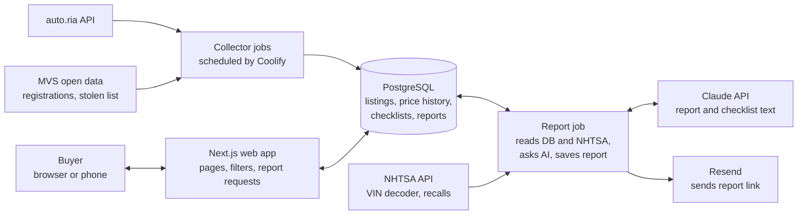

# Avtoskop — MVP Technical Plan

Sep 27, 2026 · @Kostiantyn

## Decisions

The MVP is built in TypeScript, runs on one Hetzner server managed with Coolify, and uses the Claude API for AI. It is paid from your own card, about $25–40 per month, plus about $40 once to generate the model checklists. Product scope is in the [MVP Product Definition](https://claude.ai/code/artifact/7d03443d-46a6-410e-8659-2ec5e6d5d516).

| Area     | Choice                                                                                                                                                                               | Why                                                                                         |
| -------- | ------------------------------------------------------------------------------------------------------------------------------------------------------------------------------------ | ------------------------------------------------------------------------------------------- |
| Language | TypeScript for website, background jobs and shared code                                                                                                                              | One language; one developer                                                                 |
| Website  | Next.js (a React framework that renders pages on the server)                                                                                                                         | Pages Google can read; one app for pages and API                                            |
| Database | PostgreSQL                                                                                                                                                                           | Good at filters, price statistics and text search                                           |
| Hosting  | One [Hetzner](https://www.hetzner.com/cloud/) cloud server with [Coolify](https://coolify.io/) (a free control panel that deploys from GitHub and runs databases and scheduled jobs) | 3–5 times cheaper than managed hosting; everything in Docker, so moving later is simple     |
| AI       | Claude API (Anthropic), model Claude Opus 5                                                                                                                                          | Best accuracy and Ukrainian text quality; strict JSON output; batch discount for checklists |
| Email    | [Resend](https://resend.com/)                                                                                                                                                        | Free plan covers the MVP                                                                    |
| Azure    | Not used                                                                                                                                                                             | The $50 credit is a Visual Studio dev/test benefit on the EPAM account                      |

No user accounts and no payments in the MVP.

## Architecture

The web app never calls outside sources while a buyer waits. Collector jobs fill the database on a schedule, and the report job runs in the background and emails the link. The web app, jobs and database all run on one server as Docker containers.

## Services and monthly cost

The estimate is about $25–40 per month at 200 reports a month. More than half of it is AI, and the global daily report cap controls that part. All figures are approximate; check each provider's pricing page before you sign up.

| Service                                                                | Used for                                     | Size                                                                        | Approx. cost / month  |
| ---------------------------------------------------------------------- | -------------------------------------------- | --------------------------------------------------------------------------- | --------------------- |
| Hetzner cloud server                                                   | Web app, jobs, PostgreSQL, Coolify           | 2 vCPU, 4 GB memory, 40 GB disk, Germany or Finland                         | €5                    |
| Hetzner server backups                                                 | Daily snapshot of the whole server           | 7 snapshots kept                                                            | €1                    |
| Off-server database backups                                            | Daily database dump, kept outside the server | Cloudflare R2 (free up to 10 GB) or Hetzner Storage Box                     | €0–4                  |
| Claude API, Claude Opus 5 ($5 / $25 per million input / output tokens) | Report text                                  | About 5,000 input and 2,000 output tokens per report, about $0.06–0.09 each | $12–18 at 200 reports |
| Claude API, Batch mode (50% off)                                       | Model checklists, generated once             | About 1,000 checklists (500 generations × 2 languages)                      | About $40 once        |
| Resend                                                                 | Report emails                                | Free plan, about 3,000 emails a month                                       | $0                    |
| Cloudflare                                                             | DNS, Turnstile bot check, R2 storage         | Free plans                                                                  | $0                    |
| Sentry                                                                 | Error tracking                               | Free plan                                                                   | $0                    |
| Domain                                                                 | Site address                                 | One .com or .com.ua                                                         | About $1              |
| GitHub                                                                 | Code, Actions, container registry            | Free plan                                                                   | $0                    |

If the AI cost is too high, switching the report job to Claude Sonnet 5 ($2 / $10) cuts that part by about 60%. That is one setting; compare quality on 20 real reports first.

Set a monthly spend limit in the Anthropic Console (for example $30) so AI cost can never run away.

## Data model

Twelve tables cover the MVP. A listing is one ad on one site; a car is one VIN that can have many listings.

| Table                             | One row is                                                | Key fields                                                                                                                                                                                                              |
| --------------------------------- | --------------------------------------------------------- | ----------------------------------------------------------------------------------------------------------------------------------------------------------------------------------------------------------------------- |
| `brands`, `models`, `generations` | A brand, model, or generation (e.g. RAV4 XA50, 2018–2025) | name, slug for web addresses, years                                                                                                                                                                                     |
| `listings`                        | One ad on one site                                        | source, source\_id, url, vin (nullable), model, generation, year, mileage\_km, price\_usd, fuel, gearbox, region, origin, customs\_cleared, accident\_stated, is\_new, photo\_urls, first\_seen, last\_seen, is\_active |
| `listing_snapshots`               | One change seen in an ad                                  | listing\_id, seen\_at, price\_usd, mileage\_km                                                                                                                                                                          |
| `cars`                            | One VIN                                                   | vin, first\_seen; listings with the same VIN link here (this is the merge)                                                                                                                                              |
| `price_labels`                    | The current label for one listing                         | listing\_id, label (cheap / fair / over / none), comparable\_count, p25, median, p75                                                                                                                                    |
| `model_checklists`                | One checklist in one language                             | generation\_id, engine, lang, content, model\_used, created\_at                                                                                                                                                         |
| `registry_records`                | One MVS registration operation                            | vin or body number (if present in the data), date, operation, region                                                                                                                                                    |
| `stolen_vehicles`                 | One entry in the MVS stolen list                          | vin or body number, date added                                                                                                                                                                                          |
| `reports`                         | One generated report                                      | id (random, used in the private link), vin, lang, email\_hash, status, content\_json, created\_at                                                                                                                       |
| `report_requests`                 | One request, for daily limits                             | email\_hash, ip\_hash, created\_at                                                                                                                                                                                      |

Emails are stored only as a hash (a one-way code) in the limits table. The plain email is used to send the report and is not kept.

## Data collection

Each source has its own scheduled job. Every job stores the raw response first, then a cleaning step turns it into table rows. A broken parser can then be fixed and re-run without fetching again.

| Source                                                    | Job                                                                  | How often                           | Notes                                                                                                                                    |
| --------------------------------------------------------- | -------------------------------------------------------------------- | ----------------------------------- | ---------------------------------------------------------------------------------------------------------------------------------------- |
| [auto.ria API](https://developers.ria.com/)               | Search each tracked model, fetch details only for new or changed ads | New ads hourly; full re-check daily | Needs an API key with a request limit per hour; confirm the limit and commercial-use terms first. Start with the 50 most-searched models |
| MVS registrations ([data.gov.ua](https://data.gov.ua/))   | Download the bulk file, load new rows                                | Monthly                             | Large files; load only cars (passenger). Check whether the data has VIN or only partial fields                                           |
| MVS stolen vehicles ([data.gov.ua](https://data.gov.ua/)) | Download the list, replace the table                                 | Daily                               | Match on VIN or body number                                                                                                              |
| [NHTSA vPIC](https://vpic.nhtsa.dot.gov/api/) and recalls | Called by the report job, per VIN                                    | On demand                           | Free; results cached per VIN                                                                                                             |
| Auction archive sites                                     | No job; the report shows links built from the VIN                    | —                                   | No scraping of these sites                                                                                                               |

An ad not seen for 3 days is marked inactive. Its history stays in the archive; that archive is the "listing history" in reports and grows every day, so collection should start as early as possible.

## Price label logic

A listing is compared with similar active listings. Cheapest quarter = cheap, most expensive quarter = overpriced, the middle half = fair. All numbers below are starting values to tune on real data.

1. **Find similar cars.** Same generation (or same model, year ±1), same fuel, same gearbox, mileage within ±30%, seen in the last 60 days. New and used are never mixed.
2. **Split by origin when possible.** If there are enough cars, compare "sold new in Ukraine" and "imported" separately, because imported cars often sell for less.
3. **Clean the set.** Count each VIN once. Drop prices below 30% or above 300% of the median; these are usually typing errors.
4. **Check the size.** Fewer than 8 similar cars → no label. The card says "Too few similar cars for a label".
5. **Compute** the 25th percentile, median and 75th percentile price (the prices below which 25%, 50% and 75% of similar cars sit).
6. **Label.** Below the 25th percentile = cheap. Above the 75th = overpriced. Otherwise fair.
7. **Show the basis.** The car page shows the range, the median and how many cars it used.

All prices are stored in USD. Prices listed in UAH or EUR are converted with the daily National Bank of Ukraine rate (free public API). Labels are recalculated nightly and when a listing's price changes.

## Car rating

Every offer gets a rating from 0 to 100 that answers "how good is this deal, and how much can I trust it?". Results are sorted by it by default. The code computes it from our data, so it costs nothing per listing and every point can be explained.

| Part              | Max points | What raises it                                                                                                            | What lowers it                                 |
| ----------------- | ---------- | ------------------------------------------------------------------------------------------------------------------------- | ---------------------------------------------- |
| Price             | 35         | Price below similar cars (from the price label step), adjusted for mileage                                                | Price above similar cars                       |
| Mileage for age   | 15         | Fewer km per year than similar cars in our data                                                                           | Far more km per year than usual                |
| History and trust | 25         | VIN shown and checked by the site; sold new in Ukraine; customs cleared; mileage matches earlier listings of the same VIN | No VIN; imported and repaired; accident stated |
| Listing behaviour | 15         | Normal time on market; price drops (room to negotiate)                                                                    | Relisted many times; very long on market       |
| Listing quality   | 10         | 10+ photos; full description; all key fields filled                                                                       | Few photos; empty description                  |

**Hard limits** override the points: mileage lower than in an earlier listing of the same VIN → at most 40 and a warning; VIN on the stolen list → the offer is hidden; not customs cleared → at most 50.

**Missing data counts as neutral**, not good or bad. The rating also gets a confidence level (high / medium / low) from how much data it used.

**What the buyer sees:** the number, a word (Excellent 80+, Good 65–79, Fair 50–64, Weak under 50), and the top three reasons, for example "12% below similar cars", "Low mileage for its age", "No VIN in the ad".

**How it gets smarter:** the weights above are starting values in one config file. After launch, tune them against what buyers do: which offers they open, and which they request reports for. Later options: let buyers choose what matters to them (for example "low mileage first"), and use AI to read photos and descriptions for damage or warning words.

## History report pipeline

The code gathers the facts and the AI only writes the text. The AI never looks anything up and may use only the facts it is given.

1. **Request.** The buyer enters an email on the car page. A bot check runs ([Cloudflare Turnstile](https://www.cloudflare.com/products/turnstile/), free and without puzzles).
2. **Limits.** The API checks three limits: \[N\] reports per email per day, \[N\] per IP address per day, and a global daily cap that keeps AI cost inside the budget. Over a limit → a clear message, no report.
3. **Queue.** A `reports` row is created with status "queued" and a job is added to a queue stored in PostgreSQL (the pg-boss library), so no extra service is needed. The buyer sees "Check your email".
4. **Gather facts.** The report job collects: registry records, stolen-car check, listing history for the VIN, NHTSA data, the model checklist and the price label. Each fact gets an id.
5. **Write.** The AI gets the facts as JSON and returns JSON: a verdict (looks fine / check carefully / avoid), reasons that each cite fact ids, and what to inspect. Output that cites unknown ids or breaks the format is rejected and retried once.
6. **Save and send.** The report is saved and the link is emailed. The link holds a long random id, so it cannot be guessed.
7. **Reuse.** The same VIN in the same language within 7 days reuses the saved report, at no AI cost.

The link goes only by email, never on screen. Otherwise one person could bypass the email limit by typing fake addresses. This changes one line on wireframe 4 ("You also get a private link on the next screen").

## Languages and search engine pages

Every page exists in Ukrainian and English at its own web address. The model and checklist pages are built for Google, because they are how new visitors will find the site.

| Page            | Web address                    | Rendering                                                     |
| --------------- | ------------------------------ | ------------------------------------------------------------- |
| Home            | /uk, /en                       | Static (built ahead of time)                                  |
| Model offers    | /uk/toyota/rav4                | Rebuilt at most every 15 minutes, so pages are fast and fresh |
| Model checklist | /uk/toyota/rav4/xa50/checklist | Static, rebuilt when the checklist changes                    |
| Car page        | /uk/car/\[id\]                 | Rendered on request                                           |
| Report          | /uk/report/\[random id\]       | Rendered on request; hidden from search engines               |

- Site text lives in two language files, handled by the next-intl library.
- Each page tells Google about its other-language version (hreflang tags), and a sitemap lists all model and checklist pages.
- Inactive car pages stay reachable, show "This ad is no longer active", and are hidden from search engines.

## Code structure and delivery

One repository with two apps and shared packages (a monorepo, managed with pnpm workspaces). One push to `main` tests, builds and deploys.

| Folder          | Holds                                                                                 |
| --------------- | ------------------------------------------------------------------------------------- |
| `apps/web`      | Next.js site and its API routes                                                       |
| `apps/jobs`     | Collectors, cleaners, report job; one Docker image, one command per job               |
| `packages/db`   | Database schema and migrations (Drizzle ORM)                                          |
| `packages/core` | Price label, VIN checks, shared types; no framework code, fully unit tested           |
| `packages/i18n` | Ukrainian and English text files                                                      |
| `infra`         | Server setup notes, Coolify settings and backup scripts, so the server can be rebuilt |

**Tools:** TypeScript in strict mode, Zod to check data from APIs and from the AI, Vitest for tests, ESLint and Prettier.

**Delivery (GitHub Actions):**

1. Run tests and type checks.
2. Build the two Docker images and push them to GitHub's container registry.
3. Run database migrations.
4. Call Coolify's deploy webhook; Coolify pulls the new images and restarts the apps.

**Local development:** Docker Compose runs PostgreSQL on your machine. Jobs can run against a saved sample of auto.ria data, so you don't spend the API limit while developing.

Secrets (API keys, database password) live in Coolify's environment settings, never in the repository.

## Milestones for phases 1 and 2

Start the auto.ria collector early (milestone 2). The listing archive only grows from the day it starts, and reports and price labels depend on it.

| #   | Milestone                   | Done when                                                                                                                            |
| --- | --------------------------- | ------------------------------------------------------------------------------------------------------------------------------------ |
| 0   | Checks before code          | auto.ria key and terms confirmed; MVS data fields checked; Anthropic API account with a monthly spend limit; Hetzner account created |
| 1   | Foundation                  | Repository, CI, Hetzner server with Coolify, and database schema exist; an empty site deploys from `main`                            |
| 2   | auto.ria collector          | 50 models collected hourly; archive grows every day; errors reported to Sentry                                                       |
| 3   | Search                      | Home picker, results with filters, car page, VIN merging; both languages                                                             |
| 4   | Price labels                | Every listing with 8+ similar cars has a label; every listing has a rating with its top reasons; results sort by rating by default   |
| 5   | Checklists and search pages | Checklists generated for all tracked generations in both languages; checklist pages and sitemap live                                 |
| 6   | **Phase 1 launch**          | Terms and privacy pages, visitor analytics, a database restore from the off-server backup tested once                                |
| 7   | Registry data               | MVS registrations and stolen list imported and matched by VIN                                                                        |
| 8   | Report pipeline             | Request, limits, queue, facts, AI text, email all working                                                                            |
| 9   | **Phase 2 launch**          | Report page live; daily AI cost stays under the cap for a week                                                                       |

## Technical risks and open questions

With one server, the main new risk is that server failing. Off-server backups and a tested restore cover it.

| Risk                          | Why it matters                                 | What we do                                                                                           |
| ----------------------------- | ---------------------------------------------- | ---------------------------------------------------------------------------------------------------- |
| Server failure                | Site, jobs and database are on one machine     | Daily server snapshots plus daily database dumps outside the server; restore tested before launch    |
| Server upkeep                 | You are the administrator                      | Automatic security updates; Coolify updates once a month; firewall open only for web traffic and SSH |
| AI cost                       | Each report costs money                        | Global daily report cap, reuse of reports for 7 days, monthly spend limit in the Anthropic Console   |
| auto.ria API limits and terms | The whole phase 1 depends on it                | Confirm in milestone 0; cache and fetch only changes                                                 |
| MVS data without full VIN     | Registry records could not be matched to a car | Check in milestone 0; if missing, the report shows only the stolen-car check and our own history     |
| Wrong AI text                 | A false claim about a car harms trust          | Facts-only input, cited fact ids, strict JSON output, a disclaimer on every report                   |
| Growing database              | The listing archive grows every day            | 40 GB disk is enough for the MVP; watch usage; the server can be resized in minutes                  |
| Personal data                 | Ukrainian personal data law applies            | No seller phone numbers stored; emails only as hashes; a privacy page                                |

**Open questions**

- [ ] Daily report limits: per email, per IP, global cap.
- [ ] The first 50 models to track.
- [ ] Name decided: Avtoskop, domain avtoskop.com.ua. Register the domain and check trademarks.
- [ ] Hosting: decided on 27 Sep 2026. The Azure credit is an EPAM Visual Studio dev/test benefit, so the MVP runs on a personal Hetzner server instead.
